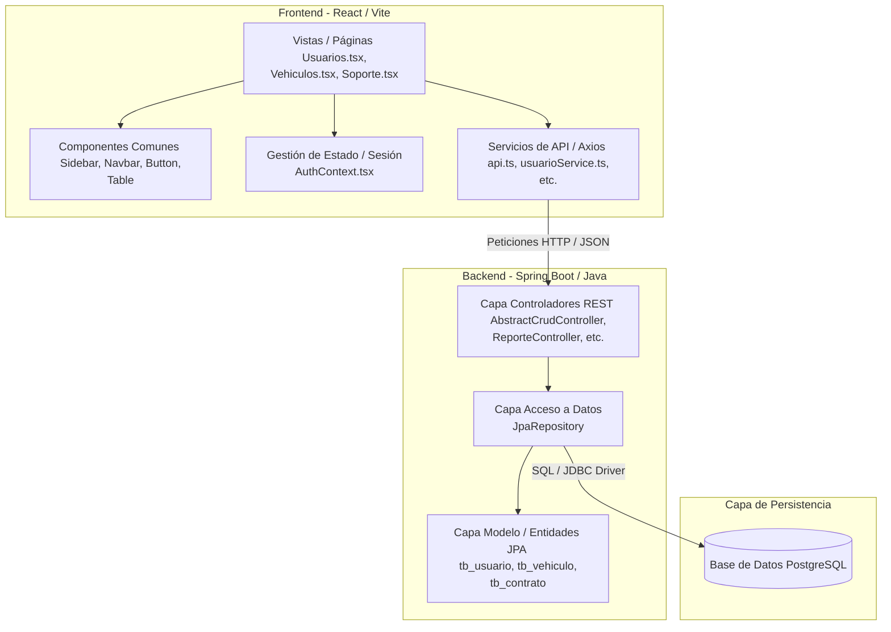
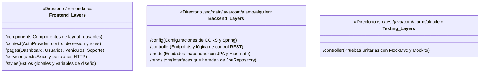
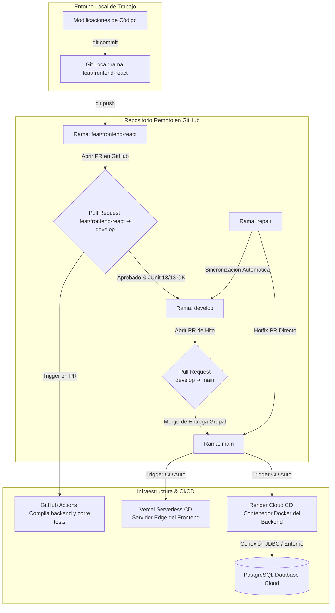

# Álamo Rent-A-Car — Manual del Desarrollador (Guía Técnica)

Este documento detalla la arquitectura de software, patrones de diseño, configuración de pruebas y pipelines de integración del sistema de alquileres **Álamo Rent-A-Car**.

---

## 🏗️ 1. Arquitectura del Sistema

El sistema implementa una arquitectura desacoplada de tipo **Single Page Application (SPA)** conectada a una **API RESTful**:

```
                       ┌─────────────────────────┐
                       │      Cliente React      │
                       │     (Vite + TS)         │
                       └────────────┬────────────┘
                                    │ Peticiones HTTP
                                    │ (Axios)
                                    ▼
                       ┌─────────────────────────┐
                       │   Backend Spring Boot   │
                       │       (Java 21)         │
                       └────────────┬────────────┘
                                    │ JDBC / JPA
                                    ▼
                       ┌─────────────────────────┐
                       │ Base de Datos PostgreSQL│
                       │  (Render / Local DB)    │
                       └─────────────────────────┘
```

### 🧱 1.1 Estructura de Capas por Arquitectura

El siguiente diagrama en capas describe el flujo de comunicación y la distribución de responsabilidades en el sistema:



---

## 💻 2. Componentes del Backend (Spring Boot)

El backend de Java está estructurado bajo las convenciones estándar de Spring Boot utilizando las siguientes capas de código:

### Capa de Modelo (Entities)
Las clases modelo representan las tablas físicas de la base de datos mapeadas con **Jakarta Persistence (JPA)**.
* **Anotaciones Clave:** `@Entity`, `@Table`, `@Getter`, `@Setter`, `@Builder`, `@NoArgsConstructor`, `@AllArgsConstructor`.
* **Entidades Clave:**
  * `Usuario`: Almacena información de colaboradores (Administradores y Counters). Relacionado con `Rol`.
  * `Vehiculo`: Representa los automóviles disponibles. Relacionado con `CategoriaVehiculo`.
  * `ContratoAlquiler`: Registra las transacciones relacionando usuario (cliente) y vehículo con sus respectivos seguros y servicios extras.
  * `SoporteTicket`: Mapea los datos de los incidentes y consultas de asistencia técnica.

### Capa de Acceso a Datos (Repositories)
Interfaces que extienden `JpaRepository<T, ID>` para interactuar de forma directa con la base de datos sin escribir SQL manual:
* **Ejemplo:** `UsuarioRepository`, `VehiculoRepository`, `ContratoAlquilerRepository`, `SoporteTicketRepository`.

### Capa de Controladores (REST Controllers)
Implementan los endpoints REST expuestos al cliente. Para optimizar el código, se diseñó un controlador genérico:
* **Clase Base:** [AbstractCrudController.java](file:///c:/Users/ASUS/OneDrive%20-%20Universidad%20Tecnologica%20del%20Peru/Documents/Proyecto%20Universidad/Alamo-1/src/main/java/com/alamo/alquiler/controller/AbstractCrudController.java)
  * Define de manera predeterminada los métodos HTTP estándar: `GET` (listar todo / obtener por ID), `POST` (crear), `PUT` (actualizar) y `DELETE` (eliminar).
* **Controlador de Reportes:** `ReporteController.java`
  * Retorna reportes en formato binario mediante endpoints específicos utilizando **Apache POI** (para hojas Excel) e **iText 8** (para documentos PDF).
* **Controlador de Soporte:** `SoporteTicketController.java`
  * Controlador dedicado para la mesa de ayuda interna.

---

## 🧪 3. Estrategia de Pruebas (JUnit 5 + Mockito)

Las pruebas están diseñadas para garantizar la estabilidad de los controladores web de forma aislada, evitando dependencias físicas con una base de datos conectada.

### Estructura de Mocking
Utilizamos `@WebMvcTest` y la nueva anotación **`@MockitoBean`** de Spring Boot 3.4.1 para mockear e inyectar repositorios simulados dentro del contexto del MVC:

```java
@WebMvcTest(UsuarioController.class)
public class UsuarioControllerTest {

    @Autowired
    private MockMvc mockMvc;

    @MockitoBean
    private UsuarioRepository repository;

    @Autowired
    private ObjectMapper objectMapper;

    // Pruebas unitarias de endpoints...
}
```

### Ejecución de Pruebas Localmente
Para ejecutar la suite de pruebas desde la terminal:
```bash
mvn test
```

---

## 🎨 4. Frontend (Vite + React + TypeScript)

La interfaz de usuario está desarrollada en React moderna utilizando **TypeScript** para asegurar la calidad y el tipado fuerte.

### Sistema de Diseño (Estilos Glassmorphic)
La apariencia estética del frontend utiliza clases CSS puras y variables personalizadas en `global.css` y `variables.css`. Soporta:
* Temas oscuros con bordes sutiles y efectos de vidrio esmerilado (`backdrop-filter`).
* Scrollbars oscurecidos y transiciones animadas para los estados `:hover` y `:active`.

### Simulación de Roles (`AuthContext.tsx`)
Un proveedor de contexto (`AuthProvider`) controla el estado de sesión local guardado en `localStorage`. Dependiendo del usuario ingresado, se asigna el rol:
* `admin` -> Rol `ADMINISTRADOR` (Permiso completo para gestionar colaboradores, inventario y resolver tickets de soporte).
* Cualquier otro nombre -> Rol `COUNTER` (Acceso al registro de alquileres, flota y envío de tickets de asistencia).

### Cliente Axios (`api.ts`)
Configurado para leer dinámicamente la variable de entorno `VITE_API_URL` en producción, con fallback automático a `http://localhost:8080/api` en desarrollo local.

---

## 🚀 5. Pipeline de Integración Continua (CI/CD)

### GitHub Actions
El flujo de integración está configurado en [.github/workflows/ci.yml](file:///c:/Users/ASUS/OneDrive%20-%20Universidad%20Tecnologica%20del%20Peru/Documents/Proyecto%20Universidad/Alamo-1/.github/workflows/ci.yml):

* **Backend Job:** Configura JDK 21, descarga dependencias y empaqueta el backend corriendo la suite de tests unitarios completa (`mvn clean package`).
* **Frontend Job:** Instala dependencias npm y compila la aplicación React en producción (`npm run build`) para verificar la ausencia de fallos TypeScript.

### Despliegue en la Nube
1. **Frontend (Vercel):** Hospedado de forma estática con soporte para Single Page Application routing (configurado en `vercel.json` para redirigir todas las peticiones a `index.html`).
2. **Backend (Render):** Desplegado de forma automática a través de contenedores Docker (`docker/Dockerfile`) conectados a una base de datos PostgreSQL hospedada en la nube.

---

## 📂 6. Estructura de Código por Capas (Package Layout)

El proyecto organiza sus directorios separando claramente el cliente frontend del servidor backend, distribuyendo el código en capas modulares:



---

## 🔀 7. Flujo de Control de Ramas en Git (Git Branching Model)

El proyecto utiliza un modelo de control de versiones unificado que vincula los entornos locales, el repositorio remoto en GitHub y los servidores de Integración y Despliegue Continuo (CI/CD) para asegurar la calidad y estabilidad de cada entrega:



### Descripción del Flujo de Trabajo (Git Flow)

1. **Rama `feat/frontend-react`:**
   * Es la rama de trabajo activo donde se desarrollan los componentes React, servicios del frontend y endpoints REST del backend.
   * Al finalizar una mejora, se abre un **Pull Request (PR)** hacia la rama `develop`.
2. **Rama `develop`:**
   * Actúa como el área de integración del equipo de desarrollo.
   * Al abrir un PR hacia esta rama, **GitHub Actions** compila el backend y ejecuta la suite de 11 pruebas unitarias. Si compila y las pruebas pasan en verde (`BUILD SUCCESS`), se permite fusionar los cambios.
3. **Rama `main`:**
   * Representa la versión de producción estable y libre de fallos del software.
   * Los cambios de `develop` se integran a `main` únicamente mediante Pull Requests aprobados al final de cada hito (Milestone).
4. **Rama `repair`:**
   * Reservada para correcciones de bugs o fallas críticas encontradas en producción. Una vez corregido el error, la corrección se mezcla en `main` y se sincroniza en `develop`.
